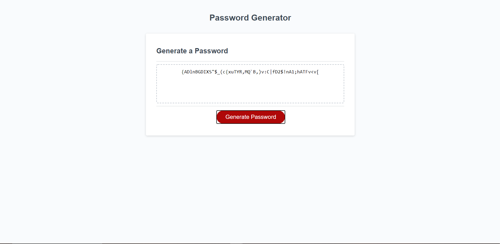

# HW3_Random_Password_Generator
This repository is for the code for a bootcamp homework with the objective of making a random password generator. 

The objective was to make a random password generator that would generate a password between 8 and 128 characters long based on criteria we gathered from the user via prompts. 
The criteria availible were as follows. 

1)Lowercase letters
2)Uppercase letters
3)numbers
4)Special characters

I achieved this by starting with an empty string and then passing in/concatenating specific Charsets after gathering the user input. Below is a link and screenshot of the webpage and an output featuring all 4 criteria. 

## Example screenshot and link
https://thecoaxial.github.io/HW3_Random_Password_Generator/

